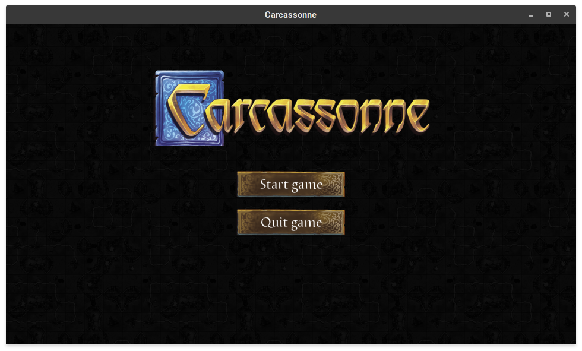
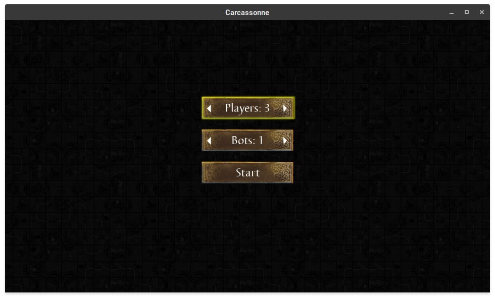
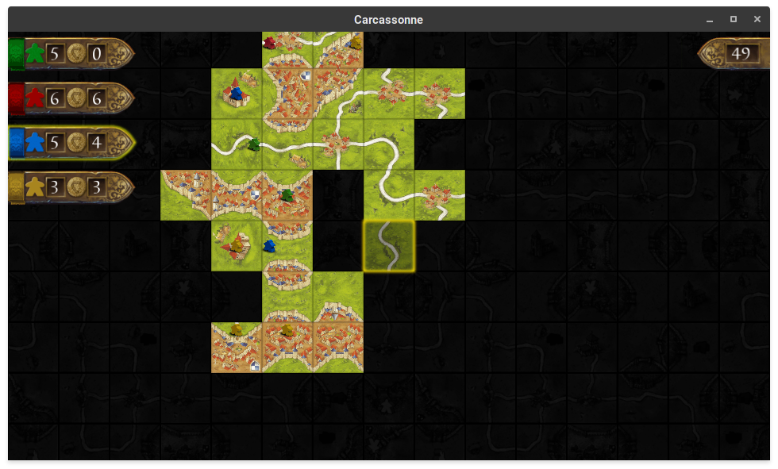

# Carcassonne

Gra w trybie graficznym - komputerowa wersja Carcassonne.

## Kompilowanie

Wymagane biblioteki: allegro5

Kompilowanie za pomocą `make`:

- `make prod` - wersja zoptymalizowana
- `make debug` - wersja z danymi debugowania

Skompilowany program powinien znajdować się w `bin/Carcassonne`.

## Dokumentacja

### Rozgrywka

W grę może grać od 2 do 5 graczy, w tym dowolna liczba graczy komputerowych (grę zawsze rozpoczynają gracze nie-komputerowi). Celem gry jest zdobycie jak największej liczby punktów za budowane obiekty. Zasady gry są skrótowo opisane w [`RULES.md`](./RULES.md), a szczegółowy opis zasad (z obrazkami) jest [tu](https://wikicarpedia.com/index.php/Base_game) i [tu](https://wikicarpedia.com/index.php/The_Farmers).

W czasie trwania gry, stan rozgrywki można sprawdzić w "tablicy wyników" z lewej strony - podana tam jest liczba podwładnych i liczba punktów każdego gracza oraz podświetlony jest gracz, do którego należy ruch.

### Kontrola klawiaturą

- menu:
  - `góra`/`dół` - zmiana aktywnego przycisku
  - `lewo`/`prawo` - zmiana liczby graczy
  - `enter` - wciśnięcie przycisku
- rozgrywka:
  - `góra`/`dół`/`lewo`/`prawo` - przesuwanie płytki/podwładnego
  - `spacja` - obrót płytki
  - `enter` - zatwierdzenie ruchu
  - `backspace` - rezygnacja z postawienia podwładnego
  - `+/-` - przybliżenie / oddalenie widoku

## Struktura programu

- `deck` - stworzenie stosu z płytkami (`deck_init()`), wymieszanie go (`deck_shuffle()`) i zwracanie kolejnych płytek (`deck_pop()`).
- `board` - przechowuje stan planszy (`struct board`), umożliwia "chodzenie" po planszy za pomocą algorytmu BFS (`board_bfs()`), modyfikowanie stanu planszy, sprawdzanie dopasowania płytki (`board_tile_matches()`), zbieranie podwładnych z planszy (`board_collect_meeple()`), obracanie płytki (`tile_rotate()`)
- `points` - zbieranie punktów z danej płytki (`collect_points()`) i z całej planszy (`collect_all_points()`)
- `game` - kolejka graczy, obsługa klawiatury
- `bot` - gracz komputerowy. Sprawdza on wszystkie możliwe ruchy, a dla każdego z nich wylicza przybliżoną wartość oczekiwaną liczby punktów, które zdobędzie tym ruchem on i przeciwnik. Do wyniku dodaje małą, losową liczbę. Wybiera ruch najbardziej opłacalny. Prawdopodobnie bot ten ma kilka błędów, ale według mnie gra zadowalająco dobrze.
- `spring` - prosta implementacja tłumionego oscylatora harmonicznego. Moduł ten nie jest związany z rozgrywką, odpowiedzialny jest za gładki ruch planszy, stopniowy wzrost liczby punktów i animacje zdobywania punktów. Dodatkowo przechowuje on obecną pozycję i przybliżenie widoku.

Więcej szczegółów jest w komentarzach w kodzie.

### Zrzuty ekranu

